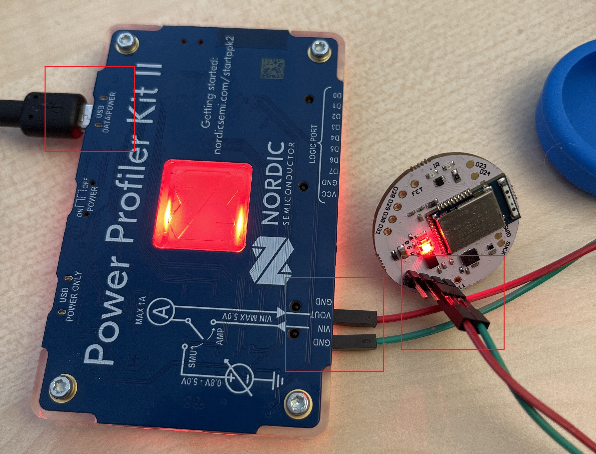
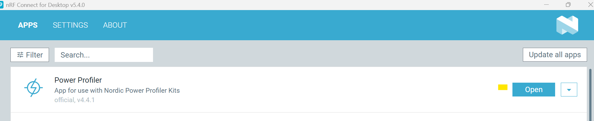
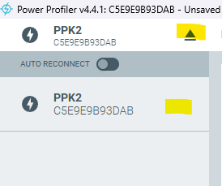
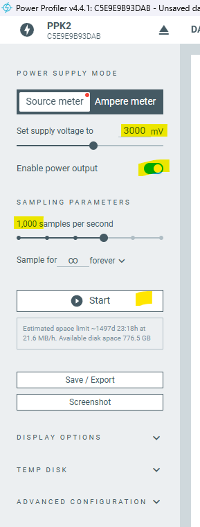
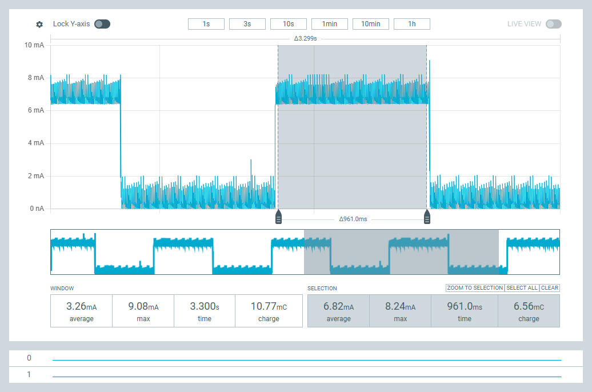
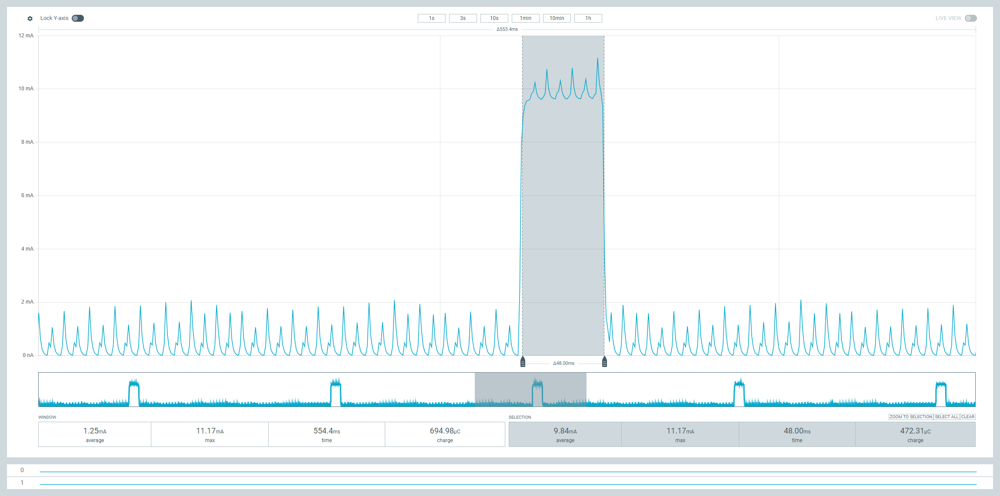

# Working Instructions for Assignment 1

## Programming the Puck.js

1. Open the Web IDE : https://www.espruino.com/ide/#
2. Connect to the Puck.js using Web BLE UART
3. Write and flash your program. To keep it safe, flash to RAM.

There are tons of tutorials:

The official one: https://www.puck-js.com/go

A concise guide: https://reelyactive.github.io/diy/puckjs-dev/

Feel free to use AI-assisted coding. Note: It seems that the LLMs have trained themselves on an old version of the Puck.js. One thing they consistently get wrong is accessing the accelerometer meter value directly under the ``accel`` object with ``accel.x`` instead of doing ``accel.acc.x``.

## Code Examples
### Periodic Execution
If you want something to happen periodically, then you can use the ``setInterval`` function in JS:

```javascript
// 1. Define the named function
function toggleRedLED() {
  LED1.toggle();
}

// 2. Pass the function name to the interval
// Note: We pass 'toggleRedLED', not 'toggleRedLED()'
setInterval(toggleRedLED, 1000);`
```

Of course, you can use anonymous functions too:

```javascript
// Variable to keep track of the LED state
var on = false;

// Run this function every 1000 milliseconds (1 second)
setInterval(function() {
  on = !on;          // Toggle the state (true becomes false, false becomes true)
  LED1.write(on);    // Write the state to the Red LED (LED1)
}, 1000);
```

### Sleeping

If you want the Puck.js to sleep, you can call ``NRF.sleep()`` which suspends the MCU but keeps BLE alive. To shutdown the BLE, you need to additionally stop advertising. But be careful: if you dont have a wake strategy, this would mean that you can no longer connect to the Puck.js.

Here is how to sleep:

```javascript
function goToSleep() {
  console.log("Going to sleep...");
  LED1.reset(); // Turn off LED(s) before sleep
  NRF.setAdvertising({}); // Stop advertising
  NRF.sleep(); // Put radio to sleep
}
```

When you wakup the MCU, you need to also start the NRF BLE advertisements:

```javascript
function wakeUp() {
  NRF.wake(); // Wake the radio
  console.log("Woke up!");
  LED1.set(); // Turn on LED to show it's awake
}
```

### Debugging?
Not really. At the best you can use ``console.log("msg")`` to find out where you are going wrong.

### BLE Advertising
The Puck.js can send out custom advertisement packets. You need to call the ``NRF.setAdvertising`` function. For example:
```javascript
// 1. Define your three data bytes
var byte1 = 0xAA; // 170 in decimal
var byte2 = 0xBB; // 187 in decimal
var byte3 = 0xCC; // 204 in decimal

function updateAdvertising() {
  // 2. Set the advertising packet
  NRF.setAdvertising({
    // 0xFFFF is a generic/testing manufacturer ID
    // The array contains your 3 custom bytes
    manufacturer: 0xFFFF,
    manufacturerData: [byte1, byte2, byte3]
  });
  
  console.log("Advertising updated with: " + [byte1, byte2, byte3]);
}

// Run the function to start advertising
updateAdvertising();
```

## Using the NRF Power Profiler Kit

This video here explains the device comprehensively:

https://www.youtube.com/watch?v=B42lPvkUSoc&list=PLx_tBuQ_KSqE6HPC-8ho6ZnJUu3FD4U0n&index=1

But for your purpose, here is what you do:

1. Go to the Lab. You have two Power Profiler kits already connected to a Puck.js each (The Pucks should **not** have the Battery inserted).
2. In case connections have been removed, dont panic. See this image and reconnect accordingly:

- USB is connected to the "USB Data Power" port (not to USB Power Only)
- Red wire to VOUT. Green to Gnd on the Power Profiler. Red to 3v and Green to Gnd on the Puck.js

3. Start NRF Connect Desktop application
4. Start the Power Profiler application  



5. Connect to the Profiler  


6. Setup the Profiler
**Important: Ensure that the voltage is 3000mV before switching the power ON!!!**  


1. Set the Voltage to 3000mV (this should be saved automatically for next session)
2. Switch ON the power. You will see the Profiler LED glow red.
3. Set sampling rate to 1000/s
4. Click on Start to record the values
5. After stopping you can zoom in/out and highlight a particular time window to get the details.
6. You can save the PPK2 file using the Save button (choose the PPK2 file option)

### How to Meausure Energy Consumed by a Specific Code Part
You can use a simple trick: switch on LED for brief moment before executing the code part and then again after the code part. You will see to huge peaks in the profile. What is in between is the consumption due to the code part. Here is how to do it:

1. Probe the LED's power consumption
```javascript
var state = false;
function probeLED(){
  state = !state;
  LED1.write(state);
}

setInterval(probeLED, 1000);
```
On the Profiler you should get something like this:


Note the average current current consumption (6.82mA).

2. Now probe the function:
```javascript

function foo(){
  // Adding 'var' makes this a local variable, which is much faster
  for(var i=0; i<100; i++){
    Math.random(); 
  }
}

function probeFunction(){
  //1. Turn LED on to mark the start
  LED1.write(1); 
  // 2. Run the function
  foo();
  // 3. Turn LED off to mark the end
  LED1.write(0);
}


setInterval(probeFunction, 1000);
```
You will see a profile like this:


The current consumption during the function execution has been about 9.8mA. Take the difference (9.8-6.82mA) as the load caused by the function. This is a good estimate (but not perfect).

## Convenience Utilities

### BLE Advertisement Receiver

This program listens for advertisements from **any** Puck.js and dumps the results to the console. So, if you are in presence of other Pucks, then you are going to get all adverstiments. It can decode packets that have three bytes (the acceleration components) or one byte that represents classification ouput and display it on the console.

### Training Data Sender and Receiver
To gather training data from Puck.js:

1. Flash the Puck.js with ``puck-data-sender.js``
2. On your PC run the ``host-training-data-reciever.py`` after configuring the Puck name (example "Puck.js e011" - can be found when you connect from Web IDE) and the filename for the action you are going to observe (example: straight.csv, lefttwist.csv, and righttwist.csv).
3. Keep the puck turned right/left/straight, press the button (and keep it pressed). It starts sending data to the host. While the button is pressed, slightly vary the position. The release the button.
4. Ctrl-c and stop the host program. The data would be saved to the respective csv file.

### Deliverables
Place all your deliveries **strictly** according to the structure given in this repsository under the folders ``delivery-part-1`` and ``delivery-part-2``. Provide your repsonses in the ``reponses.md``. Copy the PPK2 files to the provided sub-folders. In your explanation of the power consumption, liberally use screenshots from the Power Profiler.

#### Delivery
You have two options (1) Clone this repositiory to your PC, provide the required files and repsonses in the folders, Zip the content and upload to Canvas. (2) Fork this repository to your account, push your files and share your fork with the TAs, PLUS, submit the link to your repository in Canvas.